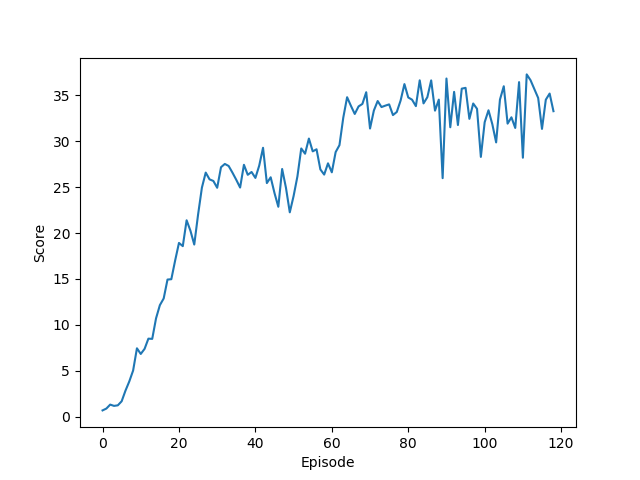

# Report

The agent was trained using Deep Deterministic Policy Gradients (DDPG).
(**Later, Prioritized Experience Replay (PER) was added for much better
performance.**)
The agent collected experiences from 20 instances in parallel and learning
took place 10 times every 20th time step (following a suggestion from the 
benchmark in the project description).

A replay buffer of size 100000 was used from which was drawn random batches of
128 experiences during training. Soft updates between both actor and
critic's local and target networks both mixed in a fraction $\tau=0.005$ of the
local network.

The discount factor $\gamma$ was set to 0.99, and a learning rate $\alpha=0.0005$
was used for both actor and critic.
 
To aid exploration, Orstein-Uhlenbeck noise (with $\sigma=0.10$, $\tau=0.15) was
added to the actors actions when gathering experiences.

After trying out various network architectures of different sizes and shapes,
I eventually settled  on the following:

**Actor network layers:**

| Input | Output | Activation function |
|-------|--------|---------------------|
| States (33) | 256 | ReLU |
| 256 | 128 | Relu |
| 128 | Actions (4) | tanh | 

**Critic network layers:**

| Input | Output | Activation function |
|-------|--------|---------------------|
| States (33) | 256 | ReLU |
| 256 + Actions (4) | 128 | Relu |
| 128 | Q-value (1)  | Linear | 

The agent solved the task in 175 episodes (that is, managed to keep an average
mean score of the twenty instances of more than +30 for 100 episodes):

## Future improvements

I initially had  problems finding a good combination of network architecture
and hyperparameters for the training algorithm.  While the combination that I
eventually settled on seems to work pretty well, there seems to still be a
fair bit of variance between runs.  It would be interesting to see how well 
automated methods for hyperparameter search would fare, be it some form of 
grid search or bayesian methods.

I would also like to try out some other algorithms (eg., PPO or A2C)
 on this problem and see if they might work even better. 
 (I briefly tried some variants of Stochastic Policy Search but could not get it to work.)

## Prioritized Experience Replay

After adding (Proportional) Prioritized Experience Replay with $\alpha=0.8$,
$\beta$ linearly increased from 0 to 1 by 0.005 per episode, and 
$epsilon = 0.05$, the agent finished the task in 119 episodes (using the same 
seed). 
 
 

## Further reading
- [Original Deep DPG paper](https://arxiv.org/abs/1509.02971)
